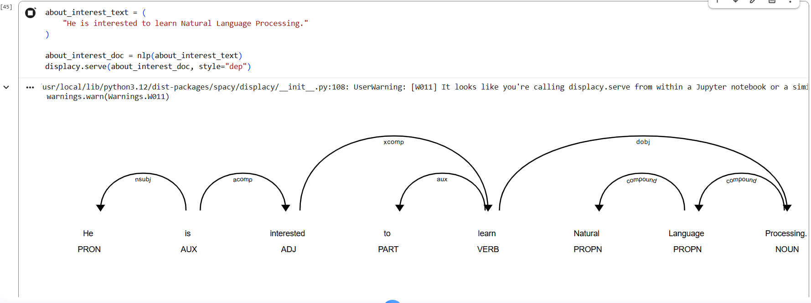

# 📝 NLP with NLTK, spaCy & displaCy

A hands-on Natural Language Processing project covering core NLP techniques — tokenization, stop word filtering, stemming, lemmatization, POS tagging, Named Entity Recognition (NER), and dependency visualization using **NLTK** and **spaCy**.

---

## 📌 Overview

This notebook walks through the fundamental building blocks of NLP using two popular Python libraries:
- **NLTK** — for classical NLP preprocessing
- **spaCy + displaCy** — for modern NLP and visualization

---

## 🧠 Topics Covered

| Topic | Description |
|---|---|
| **Tokenization** | Splitting text into words and sentences |
| **Stop Word Filtering** | Removing common, low-meaning words |
| **Stemming** | Reducing words to their root form (e.g. *flying → fly*) |
| **Lemmatization** | Reducing words to their dictionary form |
| **POS Tagging** | Labeling grammatical roles (noun, verb, etc.) |
| **NER** | Identifying named entities (people, places, orgs) |
| **displaCy Visualization** | Rendering dependency parse trees and entity spans |

---

## 🗂️ Project Structure

```
nlp-spacy-displacy/
│
├── NLP_spaCy_displaCy.ipynb    # Main notebook
├── dependency_parse.png        # displaCy dependency diagram
├── requirements.txt
└── README.md
```

---

## 🔧 Tech Stack

| Library | Purpose |
|---|---|
| `nltk` | Tokenization, stemming, lemmatization, stop words |
| `spacy` | NER, POS tagging, dependency parsing |
| `displacy` | Visualization of NLP results |

---

## 🚀 Getting Started

This notebook is recommended to run on **Google Colab** (no setup required).

1. Go to [colab.research.google.com](https://colab.research.google.com)
2. Click **File → Upload notebook** and upload `NLP_spaCy_displaCy.ipynb`
3. Run this cell first to download required NLTK data:

```python
import nltk
nltk.download('punkt_tab')
nltk.download('stopwords')
nltk.download('wordnet')
```

4. Run all remaining cells normally — spaCy and `en_core_web_sm` are pre-installed on Colab

---

## 🖼️ Dependency Parse Visualization

displaCy renders a visual dependency parse tree showing grammatical relationships between words:



---

## 📌 Example — Named Entity Recognition

```python
raw_text = "The Indian Space Research Organisation is headquartered in Bengaluru."
text1 = NER(raw_text)
for word in text1.ents:
    print(word.text, word.label_)

# → Indian Space Research Organisation  ORG
# → Bengaluru  GPE
```
